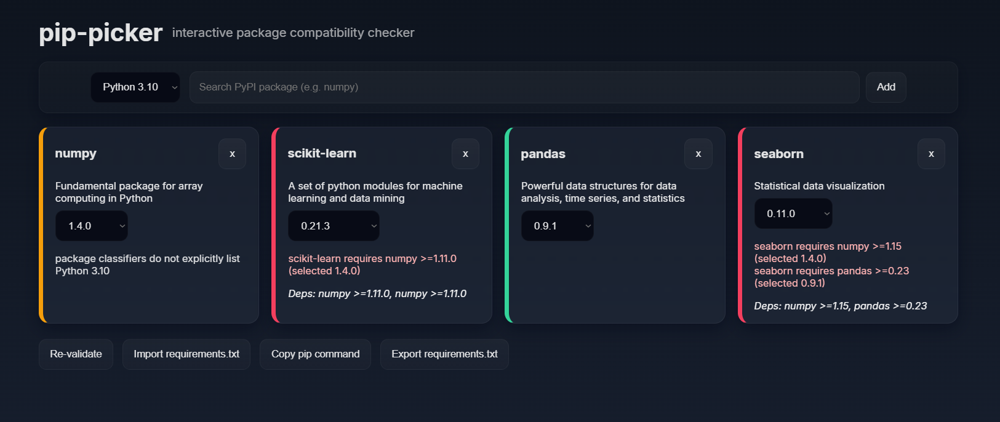

# pip-picker

pip-picker is a small Next.js prototype for interactively selecting Python packages and performing simple compatibility checks using PyPI metadata.



-- Quick summary

- Search PyPI packages and add them to the workspace
- Choose package versions (defaults to the newest available)
- Validate compatibility between the selected packages for a chosen Python minor version
- Export a pinned `requirements.txt` or copy a `pip install` command

Why this exists

This tool helps you quickly sanity-check whether a selected set of packages are likely to be compatible with a target Python minor version by using metadata published on PyPI (e.g. `requires_dist` and `classifiers`). It is intentionally lightweight and focused on quick feedback rather than full dependency resolution.

Getting started (Windows `cmd.exe`)

```cmd
cd c:\Users\user\pip-manager
npm install
npm run dev
```

Open http://localhost:3000 in your browser.

Important files & behavior

- `pages/index.js` — main UI: search, add packages, choose versions, import/export, drag-drop requirements.txt
- `pages/api/search.js` — fetches package metadata and release versions from PyPI (cached)
- `pages/api/validate.js` — naive compatibility checker that parses `requires_dist` and compares version specifiers / classifiers against the selected Python version
- `lib/pypiCache.js` — in-memory cache for PyPI JSON responses used by the API routes
- `public/robots.txt` — blocks crawlers from the `/api/` routes (advisory; use server-side protection for stronger security)

Importing requirements

- You can import a `requirements.txt` file using the Import button or drag-and-drop onto the empty state. The importer will attempt to parse simple lines like `package==1.2.3` and `package>=1.2` and select an appropriate package version when possible.

Exporting

- Use the "Export requirements.txt" button to download a generated file. Selected versions are pinned when available.

SEO, favicon & robots

- A favicon is loaded from `public/img/icon1.png` (or `/img/icon1.png`). If you change the file, hard-refresh the browser window to avoid cache issues.
- `public/robots.txt` is present to discourage crawlers from scraping `/api/` routes. This is advisory — use rate-limiting or auth for strong protection.

Limitations & notes

- Compatibility checks are heuristic and not a replacement for running an actual dependency resolver. They rely on author-provided metadata which can be incomplete or inconsistent.
- Version comparison in the frontend is a simple segment-aware comparator and does not fully implement PEP 440. For strict resolution, consider using Python's `packaging`/`pip` on the backend.

API (development)

POST `/api/validate`
- Payload: `{ packages: [{ name, version }], python_version: '3.11' }`
- Response: `{ overallCompatible: boolean, python_version: string, packages: [{ name, version, status, details, requires }] }`

Contributing

- PRs are welcome. Keep changes small and focused.
- If you add server-side resolution (recommended for correctness), prefer adding it behind an API route and respecting rate limits.

Troubleshooting

- Favicons are aggressively cached by browsers. If the icon doesn't update, try an incognito window or a hard reload (DevTools -> right-click reload -> Empty Cache and Hard Reload).
- If imports don't select expected versions, the importer may not understand complex PEP 508 markers or extras — file an issue or add test cases and I can extend parsing.

License

This repository is a prototype. Add a license file if you plan to publish it.

If you want, I can add:
- server-side (PEP 440) version resolution using the `packaging` library
- nicer UI toasts instead of `alert()` messages
- a small rate-limiter for `/api/*` routes

Ask which of these you'd like next and I will implement it.
